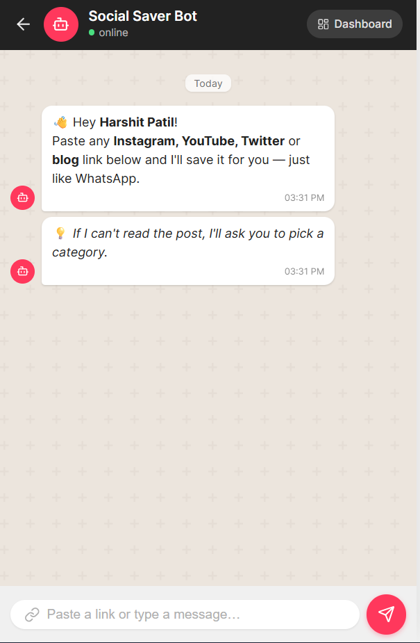
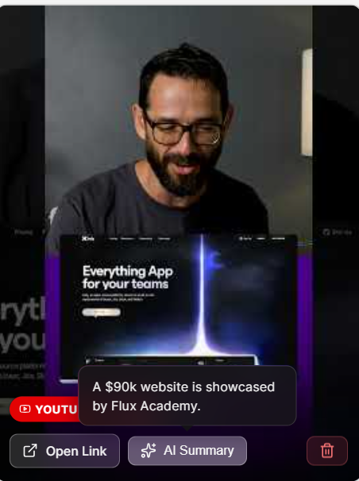

# Risk Analyzer


A cybersecurity tool that scans URLs, emails, QR codes, and social media posts for phishing threats, scam patterns, and fraud indicators. It combines rule-based heuristics, trained ML models, and optional external threat intelligence APIs to produce an explainable risk score.

---

##  UI Screenshots

### Dashboard


### Chat Window



### AI Summary



---

##  What it does

* **URL scanning** — checks domain structure, TLD reputation, brand impersonation, scam keywords, and queries Google Safe Browsing, VirusTotal, PhishTank, and URLhaus when API keys are present.
* **Email scanning** — detects urgency language, sensitive info requests, threatening tone, embedded URLs, and auto-triggers a fraud model when financial language is found.
* **Social media post scanning** — checks for fake giveaways, crypto investment scams, impersonation, off-platform contact requests, and urgency pressure.
* **QR code scanning** — decodes a QR code image and runs the extracted URL through the full URL scan pipeline.

Each scan returns a **0–100 risk score**, a **label (Safe / Suspicious / Dangerous)**, detected indicators with plain-language explanations, and a score breakdown by category.

---

##  ML Models

Three models are pre-trained and stored in `backend/models/`:

| Model file                                               | Algorithm                    | Trained on                                      | Purpose                      |
| -------------------------------------------------------- | ---------------------------- | ----------------------------------------------- | ---------------------------- |
| `phishing_model.joblib`                                  | Gradient Boosting            | Kaggle phishing URL dataset                     | URL phishing probability     |
| `social_model.joblib` + `social_vectorizer.joblib`       | TF-IDF + Logistic Regression | phishing_email.csv + CEAS_08.csv (~121k emails) | Email / social text phishing |
| `transaction_fraud_model.joblib` + `fraud_scaler.joblib` | XGBoost                      | creditcard.csv (284,807 transactions)           | Financial fraud detection    |

The models are already trained and included. Re-training is optional — scripts are in `backend/training/`.

---

##  Project structure

```
backend/          FastAPI server, ML inference, heuristics, scoring
  engine/         Core logic: heuristics, ML models, scorer, intel, API checker
  models/         Pre-trained .joblib model files
  routers/        API route handlers (scan, qr, bulk, transaction)
  training/       Training scripts and datasets
frontend/         Next.js 19 web UI
  src/app/        Page layout and global styles
  src/components/ Scanner panel, results scorecard, indicator cards
extension/        Chrome/Edge browser extension (Manifest v3)
```

---

##  Requirements

* Python 3.10+
* Node.js 18+
* (Optional) Google Safe Browsing API key and VirusTotal API key for external threat intel

---

##  Setup

### 1. Backend

```bash
cd backend
python -m venv .venv

# Windows
.venv\Scripts\activate

# macOS / Linux
source .venv/bin/activate

pip install -r requirements.txt
```

Create a `.env` file in `backend/` for optional API keys:

```
GOOGLE_SAFE_BROWSING_API_KEY=your_key_here
VIRUSTOTAL_API_KEY=your_key_here
```

If these are not set, the system still works fully using local models and heuristics. PhishTank and URLhaus are always queried (no key needed).

Start the server:

```bash
python -m uvicorn main:app --port 8000
```

API docs available at:
http://localhost:8000/docs

---

### 2. Frontend

```bash
cd frontend
npm install
npm run dev
```

Open:
http://localhost:3000

---

### 3. Browser Extension (optional)

1. Open Chrome or Edge and go to `chrome://extensions`
2. Enable **Developer mode**
3. Click **Load unpacked** and select the `extension/` folder

The extension scans the URL of the current tab by sending it to the backend at `http://localhost:8000`.

---

##  API endpoints

| Method | Endpoint       | Description               |
| ------ | -------------- | ------------------------- |
| POST   | `/scan/url`    | Scan a URL                |
| POST   | `/scan/email`  | Scan email text content   |
| POST   | `/scan/social` | Scan a social media post  |
| POST   | `/scan/qr`     | Scan a QR code image file |
| GET    | `/`            | Health check              |

---

##  Scoring

Scores are **0–100**. Thresholds:

* **0–30** → Safe
* **31–60** → Suspicious
* **61–100** → Dangerous

When the ML model is available, it contributes **60% of the score**. External API results (when keys are configured) shift the weighting further. If only heuristics are available, domain, structural, and language signals fill the full weight.

---

##  Re-training models (optional)

Training scripts expect datasets placed in `backend/training/dataset/`. See the comment at the top of each script for the required filename and source.

```bash
cd backend
python training/train_model.py          # URL phishing model
python training/train_social_model.py   # Email / social model
python training/train_fraud_model.py    # Transaction fraud model
```
